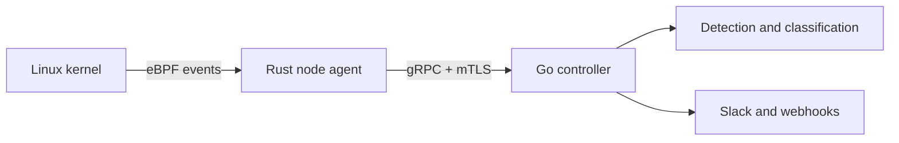

# Danushka Stanley

### Senior DevOps Engineer building secure, observable cloud-native systems

**AWS · Kubernetes · Terraform · Platform Engineering · eBPF · Go · Rust**

  
  
  

📍 Sri Lanka  
**MSc Cybersecurity & Forensics — Distinction**  
University of Westminster

---

## About me

I design and operate multi-region AWS platforms, build IaC-first delivery systems, and create practical tooling for Kubernetes reliability and runtime security.

Most of my work begins with an operational problem: reduce uncertainty, automate the repetitive parts, preserve useful evidence, and leave behind something safer and easier to operate.

My current focus is:

- 🔎 **Kubernetes diagnostics** — making workload memory behaviour understandable with KubeMemLens
- 🛡️ **Runtime security** — continuing my eBPF-based Kubernetes RASP research through KyNox
- 🧠 **MLOps and MLSecOps** — applying platform reliability, supply-chain security and observability practices to model delivery
- ✍️ **Technical writing** — sharing practical lessons from Kubernetes, DevSecOps, eBPF and production engineering

---

## Featured project: [KubeMemLens](https://github.com/danushkastanley/KubeMemLens)

> **See why your Kubernetes Pod memory is high.**

  
  
  
  

KubeMemLens is a terminal-first Kubernetes memory inspector built after a real production investigation where the Pod memory number was high, but the application heap did not explain it.

Instead of presenting one aggregate number, it separates observed cgroup memory into **anonymous memory, filesystem-backed cache, shmem/tmpfs and residual memory**, then adds pressure, OOM, writeback and workload context.

Its current workflow includes:

- An incident-focused TUI with node, namespace, workload, Pod and container navigation
- Memory composition, limits, headroom, trends, pressure and OOM evidence
- Historical investigation, safe incident capture, replay and before/after comparison
- Read-only recommendations with rationale and guard conditions
- Structured JSON, YAML and CSV output for automation
- Authenticated access through the Kubernetes aggregation layer
- Published lifecycle and scale-qualification evidence, including a 5,000-container local RC run

> [!IMPORTANT]
> KubeMemLens is currently in alpha and is intended for evaluation on disposable or explicitly authorised clusters. It does not yet carry a production stability or support guarantee.

[**Repository**](https://github.com/danushkastanley/KubeMemLens) ·
[**Documentation**](https://github.com/danushkastanley/KubeMemLens/tree/main/docs) ·
[**Releases**](https://github.com/danushkastanley/KubeMemLens/releases) ·
[**Report an issue**](https://github.com/danushkastanley/KubeMemLens/issues)

---

## Runtime security research: KyNox

**KyNox** is the open-source continuation of my MSc dissertation research into eBPF-based Runtime Application Self-Protection for Kubernetes.

It combines a privileged **Rust and libbpf-rs node agent** with a **Go control plane**, using gRPC and mutual TLS to transport security-relevant workload telemetry.

The research explores:

- Process execution and parent-child activity
- Filesystem access and permission changes
- Network connections and socket operations
- Privilege, capability and `ptrace` activity
- Kubernetes workload-context enrichment
- Event classification, rate limiting and alert aggregation

  
  

> [!NOTE]
> KyNox is a pre-1.0 research prototype for controlled, non-production evaluation. It provides telemetry and detection signals rather than replacing Kubernetes hardening, admission control or incident response.

---

## Selected engineering impact

| Focus | Outcome |
|---|---|
| **Reliability and observability** | Improved MTTA from hours to approximately **1 minute** and MTTR from approximately **4–5 hours to under 1 hour** through a Datadog observability migration |
| **Delivery automation** | Reduced post-deployment validation from approximately **60 minutes to 10 minutes** using Playwright and evidence-backed notifications |
| **Platform engineering** | Built a reusable library of **30+ Terraform modules** for standardised multi-region AWS environments |
| **Kubernetes adoption** | Migrated production workloads from **Elastic Beanstalk to Amazon EKS** using IaC-first change control |
| **Secure software delivery** | Rolled out SonarQube quality gates across **300+ repositories** and introduced automated OWASP ZAP validation |
| **Incident response** | Built actionable monitoring and operational workflows across Datadog, CloudWatch and PagerDuty |

---

## Toolbox

  

  <code>Amazon EKS</code>
  <code>Helm</code>
  <code>Argo CD</code>
  <code>Buildkite</code>
  <code>Datadog</code>
  <code>CloudWatch</code>
  <code>PagerDuty</code>
  <code>Playwright</code>
  <code>GitHub Actions</code>

---

## Engineering principles

> **Fewer features, stronger guarantees.** Automate to reduce cognitive load, make failures explainable, and treat security as part of the platform rather than something bolted on afterwards.

---

## Writing and collaboration

I write about **Kubernetes, eBPF, cloud security, platform reliability, DevSecOps and applied AI** at [danushkastanley.com](https://www.danushkastanley.com).

Contributions, non-production test reports and well-scoped issues are welcome on [KubeMemLens](https://github.com/danushkastanley/KubeMemLens).

### Build reliable systems. Make failure explainable. Keep security practical.

[Website](https://www.danushkastanley.com) ·
[GitHub](https://github.com/danushkastanley) ·
[KubeMemLens](https://github.com/danushkastanley/KubeMemLens)

